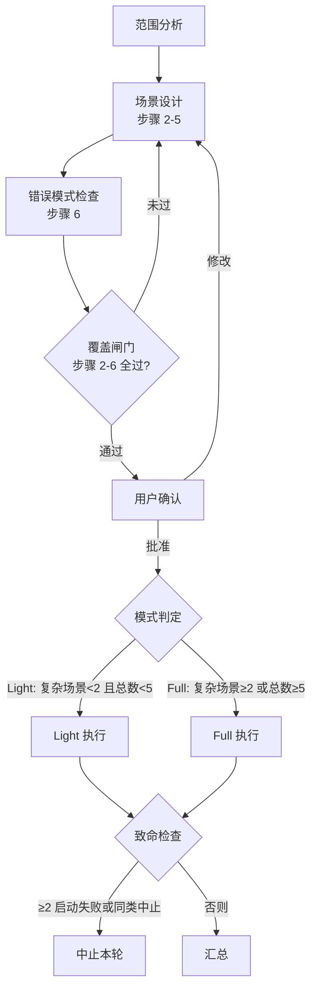

# 快速测试一个技能

对象已写好、或刚修过一轮 —— 判「零上下文 agent 能不能理解它、走通流程、完成任务」，这个检查叫**推演**：不实际执行技能，让子代理照着文档预演「如果照这份指引做，会发生什么、会在哪里卡住」。这判的是**全不全、用不用得起来**，不是「写得对不对」——对错由[审查](skill-review.md)的三源比对去发现，写全了没有只有让人走一遍才知道。与功能正确性测试互补：那个验证技能能加载、能执行，这个验证 agent 能理解、能走通。前提：运行时支持子代理委派，没有委派能力的环境用不了这个工作。

## 什么时候用

- 新技能交付前的可用性验证
- 修改技能后的回归验证（修复是否真修好了，卡点是否清零）
- 多轮迭代，追踪质量趋势
- 与 baseline 对照：加载与不加载技能的行为差异

## 流程总览

## 六步测试设计

| 步骤 | 产出 | 方法文件 |
|------|------|---------|
| 1. 识别输入空间 | 功能域、路径集、决策点、能力边界 | [范围分析](quick-test/scope-analysis.md) |
| 2. 等价类划分 | 使用场景组合（入口 × 明确度 × 上下文） | [场景设计](quick-test/scenario-design.md) |
| 3. 边界测试 | 每条声称边界的双向测试 | [场景设计](quick-test/scenario-design.md) |
| 4. 决策逻辑覆盖 | 决策树分支路径（仅当有决策点） | [场景设计](quick-test/scenario-design.md) |
| 5. 端到端用例 | 复杂场景 + baseline | [场景设计](quick-test/scenario-design.md) |
| 6. 错误模式检查 | 反模式逐条扫描结果 | [错误模式清单](quick-test/error-patterns.md) |

每步同时产出设计动作与覆盖标准；覆盖闸门在步骤 2–6 之后——全部通过才进用户确认，标准逐条见场景设计。

## Light / Full 双模式

| | Light | Full |
|---|---|---|
| 适用 | 复杂场景 < 2 且总数 < 5 | 复杂场景 ≥ 2 或总数 ≥ 5 |
| 测试计划 | 对话中口头确认，不写文件 | 先写 `test-plan.md`（计划闸门，不过不委派） |
| 子代理产出 | 返回值报告，禁止写文件 | 写入 `reports/` 目录 |
| 汇总数据源 | 子代理返回值 | 读取报告文件 |

临时目录：`$SKILL_TEST_DIR/<round-id>/`，未设置时回退 `<cwd>/.quick-tests/<round-id>/`。

## 核心约束

五条硬约束；委派格式、中止判据的完整细节在[Light 执行](quick-test/execution-light.md)与[Full 执行](quick-test/execution-full.md)里，此处是判断依据。

- **隔离铁律（信息边界）**：子代理 context 绝不出现——预期效果、其他测试单元的存在、baseline/实验组区分、任何对比信息。子代理只拿到：使用场景 + 入口路径 + 目标 + 加载规则 + 推演指引 + 失败行为。理由：知道预期会引导子代理「朝着正确答案走」，那时测的是提示词不是技能；baseline 的价值正在「不知道技能时 agent 会怎么做」。同理，测试场景不能只挑自己能通过的那个——那是用通过率粉饰覆盖率。
- **加载规则**：子代理用文件读取能力、按被测技能自身的文件路径读取它的全部文件；**禁止**通过技能加载机制读取被测技能——那拿到的是运行时已安装版本，不是被测文件。
- **能力模拟**：被测技能引用的外部能力不实际调用，模拟执行并记录假设。测试目标是文档的清晰度：文档写得清楚，子代理应能推演出预期结果。
- **失败行为（容错）**：子代理遇系统性障碍不自行绕道，直接返回「推演中止」报告；主代理侧 ≥2 个子代理启动失败、或 ≥2 个同类系统性中止 → 中止本轮，报告诊断，不产带病汇总。推演查的是「按这份指引走会怎样」，指引本身断掉时推演已无对象。
- **呈现原则**：中间过程（范围分析、场景设计过程、覆盖检查细节）不主动展示，只在用户确认节点给出简洁用例列表；用户要看过程时再展开。

报告格式是硬约束：禁止 JSON 与自由文本，章节缺失即报告不合格。理由：格式不统一的返回值（JSON、自由文本、混合）在汇总阶段解析困难——约束格式是汇总可行性的前提，不是偏好。

## 与其他工作的衔接

- 来自[修改](skill-modify.md)：卡点修复后回本工作做回归验证；修改参考把这里的卡点清单列为合法入口。
- 流向[修改](skill-modify.md)：汇总产出的缺陷清单（文件:行号 + 描述 + 严重度 + 发现场景数）就是修改工单。
- 与[审查](skill-review.md)的分工：本工作判「用不用得起来」（写全了没有），审查判「写得对不对」（说的和做的是一回事吗）。两条都过才算交付就绪。委派的纪律各自独立：审查委派为发现盲区，本工作的隔离是不给预期——并存，不互相替代。
- 卡点修不动、或发现根子在设计意图 → 回[设计](skill-design.md)重答三问（为什么回锚定，见其推荐路径一节）。
- 汇总产出的病灶实例（死链、自违等）可反向喂给[审查](skill-review.md)的定位。

## 触发测试单元

在主框架内补充一种单元：测 description 在真实触发场景下能否被语义匹配选中——正文测试单元答「加载后能不能理解走通」，触发测试单元答「该不该被加载」。它复用本工作的场景设计、委派与汇总，只换测的对象与评估视角，是可选补充。盲测原理、技能池设计、漏题硬护栏见[触发效果检查](quick-test/trigger-check.md)。

## 方法目录

| 文件 | 用途 |
|------|------|
| [范围分析](quick-test/scope-analysis.md) | 步骤 1：提取输入空间（功能域/路径集/决策点/边界） |
| [场景设计](quick-test/scenario-design.md) | 步骤 2–5：等价类/边界/决策/用例 + 覆盖标准；另承载步骤 6 之后的覆盖闸门与模式判定 |
| [错误模式清单](quick-test/error-patterns.md) | 步骤 6：反模式清单（随测试经验累积，只增不减） |
| [Light 执行](quick-test/execution-light.md) | Light 模式委派格式、能力模拟、中止检查 |
| [Full 执行](quick-test/execution-full.md) | Full 模式目录结构、计划闸门、报告管理 |
| [汇总评估](quick-test/summarization.md) | 致命检查 → 逐场景对比 → 多单元对比 → 缺陷去重 → 打分 |
| [五维打分](quick-test/scoring-rubric.md) | 可选评分标准，汇总之后由主代理执行 |
| [触发效果检查](quick-test/trigger-check.md) | 触发测试单元：盲测 description 的触发效果 |

模板：测试计划、场景卡片、汇总报告在 `templates/`（打包目录），按 Full 模式流程取用。
